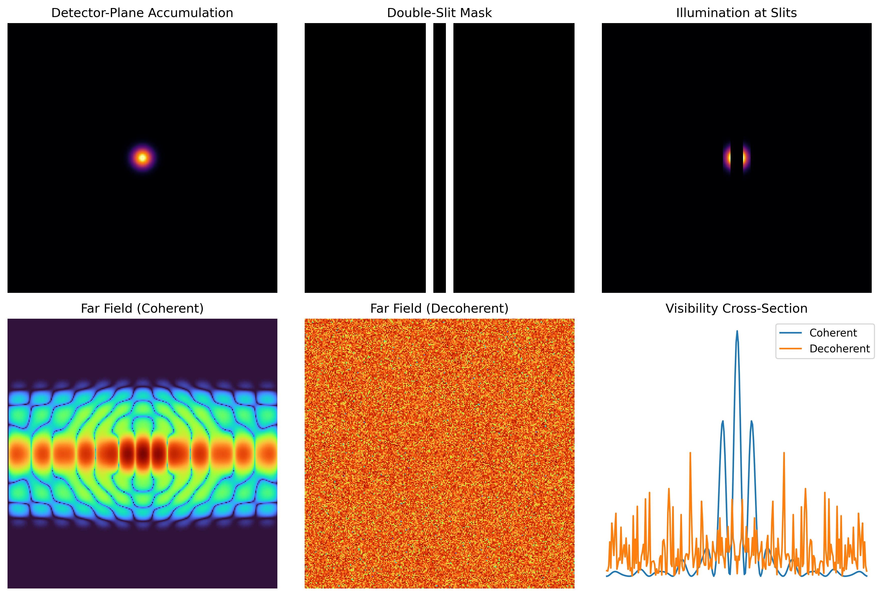

# Detector-Plane Imaging & Imprint Field Dynamics (DPI + IFD)

© 2025 Srikar R.  
Released under the Creative Commons Attribution 4.0 International (CC BY 4.0) license.

---

## Overview

This repository presents a unified framework combining **Imprint Field Dynamics (IFD)** and **Detector-Plane Imaging (DPI)** to study coherence, interference, and decoherence from a **measurement-plane perspective**.

The framework is entirely classical at the field level and is intended to clarify how structured interference patterns arise and are recorded by real detector systems used in quantum optics laboratories.

---

## Imprint Field Dynamics (IFD)

Imprint Field Dynamics describes the **pre-measurement evolution** of a continuous physical field governed by nonlinear dynamics.

In this framework:
- The field evolves continuously in space and time.
- Nonlinear interactions support **localized, long-lived coherent excitations**.
- These excitations generate stable spatial imprints when sampled at a plane.

Such excitations are commonly referred to as **oscillons** in nonlinear dynamics.  
They act as **coherence carriers**, preserving spatial and phase order over extended durations.

IFD does not invoke particles, photons, or measurement processes.  
It describes **field-level structure only**.

---

## Detector-Plane Imaging (DPI)

Detector-Plane Imaging treats the detector surface as a **measurement geometry**, not a passive endpoint.

In DPI:
- A detector plane samples the field intensity at a fixed spatial surface.
- No imaging optics are assumed.
- Continuous field structure is converted into discrete events through thresholding and accumulation.

DPI describes **how pre-measurement field structure is revealed** by real detectors.

---

## Relationship Between IFD and DPI

The relationship is directional:

**Imprint Field Dynamics → Detector-Plane Imaging**

- IFD defines **what structure exists** in the field.
- DPI defines **how that structure appears** at the detector plane.

Interference geometry is encoded in the detector-plane imprint **prior to detection**.  
Discrete events reveal this structure; they do not create it.

---

## Double-Slit Interpretation

Within this framework:
- Interference visibility is governed by **coherence length**, not slit geometry.
- Decoherence corresponds to correlation-length decay and loss of oscillon alignment.
- Single-photon buildup experiments reflect gradual exposure of pre-existing structure.

---

## Instrumental Scope

The framework is compatible with existing instruments, including:
- ICCD and EMCCD cameras
- sCMOS sensors
- SPAD arrays
- Time-resolved photon counters

No new hardware is required.

---

## Scope and Limitations

This work:
- Is fully classical at the field level
- Makes no claims regarding entanglement or Bell inequality violations
- Does not claim to solve the quantum measurement problem

Its contribution is interpretive: clarifying what detector-plane measurements reveal about pre-measurement coherence.

---

## License

This work is released under the **Creative Commons Attribution 4.0 International (CC BY 4.0)** license.

You are free to share, adapt, and use this material for any purpose, including commercial use, provided appropriate attribution is given and changes are indicated.

Full license text:  
https://creativecommons.org/licenses/by/4.0/

---

## Citation

If you use or reference this framework, please cite:

Srikar R. (2025). *Detector-Plane Imaging & Imprint Field Dynamics (DPI + IFD)*.  
Zenodo. https://doi.org/10.5281/zenodo.17942454

---

## Status

This repository represents the **initial conceptual release** of the DPI + IFD framework.  
Minimal reproducible simulations and detector-plane examples will be added incrementally.
